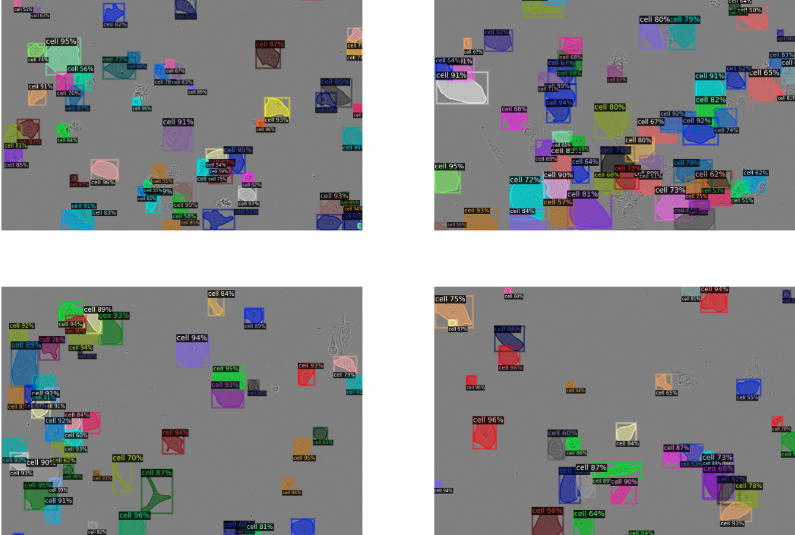

# LIVECell_segmentation

## Structure

* train.ipynb - contains code for training model

- inference.ipynb - contains code for validation and metrics

+ utils.py - contains some variables
## Installation
1. Create your new environment:
	```
	conda create --name YOUR_NAME python=3.9
	conda activate YOUR_NAME
	```
2. Clone repo:
	```
	git clone https://github.com/vlad-tkalenko/LIVECell_segmentation.git
	cd LIVECell_segmentation
	```
3. Install requirements:
	```
	pip install -r requirements.txt
	```
4. To use dvc with google services, you need to set up your Google Cloud Project. Follow [this instructions](https://dvc.org/doc/user-guide/data-management/remote-storage/google-drive#using-a-custom-google-cloud-project-recommended) to do this.
5. Pull dataset with dvc:
   	```
    dvc pull
	```
5. Run first cell of train.ipynb or inference.ipynb notebooks to install detectron2
